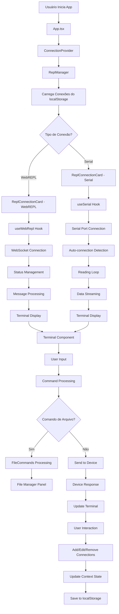
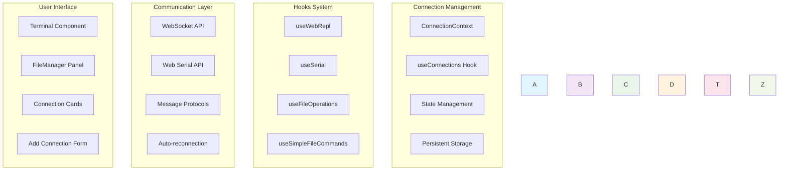

Com base na análise detalhada do código, criei um fluxograma em Mermaid que mostra o funcionamento interno da aplicação:

  Explicação do Fluxograma:

  Fluxo Principal:

  1. Inicialização: App.tsx → ConnectionProvider → ReplManager
  2. Carregamento: Conexões salvas são carregadas do localStorage
  3. Renderização: Cada conexão cria um ReplConnectionCard específico

  Gerenciamento de Conexões:

  - WebREPL: useWebRepl hook gerencia WebSocket, autenticação e reconexão
  - Serial: useSerial hook gerencia portas seriais, auto-detecção e streaming

  Processamento de Mensagens:

  - Terminal Normal: Comandos vão diretamente para o dispositivo
  - Comandos de Arquivo: Interceptados e processados pelo FileManager
  - Resposta: Dados retornam para o Terminal para exibição

  Persistência:

  - Estado gerenciado pelo ConnectionContext
  - Alterações são salvas automaticamente no localStorage
  - Reconexão automática para portas seriais baseada em vendorId/productId

  Arquitetura de Hooks:

  - useWebRepl: WebSocket, autenticação, retry com exponential backoff
  - useSerial: Serial API, auto-connection, reading loop assíncrono
  - useFileOperations: Gerenciamento de arquivos no dispositivo
  - useConnections: Context API para estado global

  Comunicação Bidirecional:

  - WebREPL: Via WebSocket com protocol específico do MicroPython
  - Serial: Via Web Serial API com configurações customizáveis
  - File Commands: Protocol especial com marcadores START e END

  O fluxograma mostra como a aplicação integra múltiplas tecnologias (WebSocket, Serial API) em uma interface unificada, com gerenciamento robusto de estado e comunicação em tempo
  real.