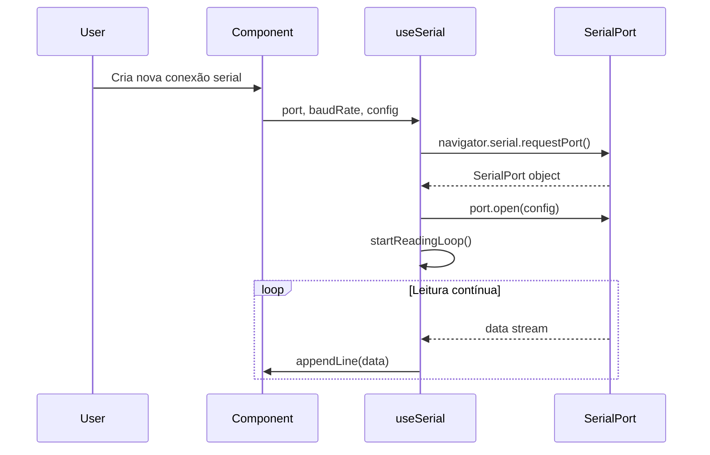
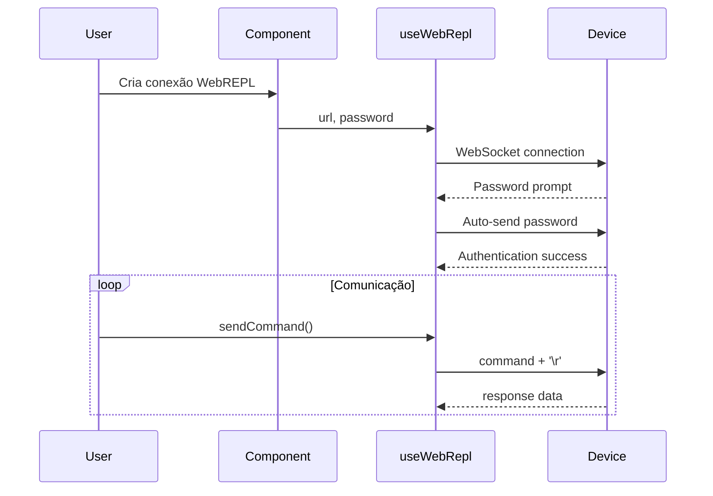

# MicroPython Multi-WebREPL Client - Documentação Técnica

## 📋 Visão Geral

O **MicroPython Multi-WebREPL Client** é uma aplicação web moderna desenvolvida em React + TypeScript que permite gerenciar múltiplas conexões simultâneas com dispositivos MicroPython através de **WebREPL** (WebSocket) e **Serial** (Web Serial API).

### 🎯 Funcionalidades Principais

- **Múltiplas Conexões Simultâneas**: Gerencie vários dispositivos MicroPython em paralelo
- **Duplo Protocolo**: Suporte tanto para WebREPL quanto para conexões seriais
- **Terminal Interativo**: REPL completo com histórico de comandos
- **Configurações Avançadas**: Baud rate, terminadores de linha, timestamps, autoscroll
- **Persistência Local**: Configurações salvas no localStorage do navegador
- **Interface Responsiva**: UI moderna e intuitiva com TailwindCSS

---

## 🏗️ Arquitetura do Sistema

### Stack Tecnológico

| Componente | Tecnologia | Versão |
|------------|------------|--------|
| Frontend | React | 19.1.0 |
| Linguagem | TypeScript | 5.7.2 |
| Build Tool | Vite | 6.2.0 |
| Styling | TailwindCSS | - |
| APIs | WebSocket, Web Serial API | - |

### Estrutura de Diretórios

```
src/
├── components/           # Componentes React
│   ├── AddConnectionForm.tsx    # Formulário de nova conexão
│   ├── ReplConnectionCard.tsx   # Card individual de conexão
│   ├── ReplManager.tsx          # Gerenciador principal
│   ├── Terminal.tsx             # Terminal interativo
│   └── icons/                   # Ícones SVG customizados
├── hooks/               # Custom Hooks
│   ├── useSerial.ts            # Hook para conexões seriais
│   └── useWebRepl.ts           # Hook para WebREPL
├── types.ts             # Definições de tipos TypeScript
└── App.tsx              # Componente raiz
```

---

## 🔧 Componentes Principais

### 1. ReplManager (Gerenciador Principal)

**Responsabilidades:**
- Gerenciamento do estado global das conexões
- Persistência no localStorage
- Renderização da grid de conexões
- Controle do formulário de adição/edição

**Funcionalidades Técnicas:**
- Serialização/deserialização de conexões
- Reconexão automática de portas seriais por `vendorId/productId`
- Gerenciamento de estado com React hooks

### 2. ReplConnectionCard (Card de Conexão)

**Responsabilidades:**
- Renderização individual de cada conexão
- Delegação para hooks específicos (Serial/WebREPL)
- Interface de controle (conectar, editar, remover)

**Padrão de Design:**
- Usa padrão Strategy para diferentes tipos de conexão
- Componentes separados: `SerialCardContent` e `WebReplCardContent`

### 3. Terminal (Terminal Interativo)

**Funcionalidades:**
- **Histórico de Comandos**: Navegação com setas ↑/↓
- **Autoscroll**: Rolagem automática opcional
- **Sintaxe Highlight**: Cores diferentes para sistema/erro
- **Limpeza**: Botão para limpar output
- **Foco Automático**: Click-to-focus no terminal

### 4. AddConnectionForm (Formulário de Configuração)

**Configurações WebREPL:**
- Nome da conexão
- Endereço IP
- Senha (opcional)

**Configurações Serial:**
- Nome da conexão
- Seleção de porta via Web Serial API
- Baud rate (300 a 2M)
- Terminador de linha (none, \n, \r, \r\n)
- Opções de display (autoscroll, timestamp)

---

## 🔌 Hooks Customizados

### useSerial (Conexões Seriais)

**Funcionalidades:**
- **Auto-conexão**: Conecta automaticamente ao receber nova porta
- **Gerenciamento de Ciclo**: Estados completos de conexão/desconexão
- **Stream Bidirecional**: Leitura/escrita assíncrona
- **Configurações Flexíveis**: Suporte a diferentes protocolos

**Estados de Conexão:**
```typescript
enum ReplStatus {
  CONNECTING = 'connecting',
  CONNECTED = 'connected', 
  DISCONNECTED = 'disconnected',
  ERROR = 'error'
}
```

**Fluxo de Conexão:**
1. Validação da porta serial
2. Limpeza de recursos existentes
3. Abertura com parâmetros configurados
4. Inicialização de streams
5. Loop de leitura assíncrono

### useWebRepl (Conexões WebSocket)

**Funcionalidades:**
- **WebSocket Management**: Conexão persistente com dispositivo
- **Auto-autenticação**: Login automático com senha salva
- **Reconexão Manual**: Sistema de retry
- **Sanitização**: Limpeza de caracteres de controle

**Fluxo de Autenticação:**
1. Conexão WebSocket
2. Detecção de prompt de senha
3. Envio automático de credenciais
4. Validação de login bem-sucedido

---

## 💾 Gerenciamento de Dados

### Persistência Local (localStorage)

**Estrutura de Dados:**
```typescript
interface ReplConnection {
  id: string;                    // Identificador único
  name: string;                  // Nome descritivo
  connectionType: 'webrepl' | 'serial';
  
  // WebREPL específico
  ip?: string;                   // Endereço IP
  password?: string;             // Senha para auto-login
  
  // Serial específico  
  baudRate?: number;             // Taxa de transmissão
  lineEnding?: LineEndingType;   // Terminador de linha
  autoScroll?: boolean;          // Scroll automático
  showTimestamp?: boolean;       // Timestamps
  
  // Metadados para reconexão
  portInfo?: {
    vendorId?: number;
    productId?: number;
  };
}
```

**Limitações:**
- Objeto `SerialPort` não é serializável (não persistido)
- Reconexão baseada em `vendorId/productId`
- Máximo ~5MB de dados no localStorage

---

## 🔄 Fluxos de Comunicação

### Conexão Serial (Web Serial API)



### Conexão WebREPL (WebSocket)



---

## ⚙️ Configurações Técnicas

### Configurações Serial

| Parâmetro | Opções Disponíveis | Padrão | Descrição |
|-----------|-------------------|--------|-----------|
| Baud Rate | 300-2M bps | 115200 | Taxa de transmissão |
| Data Bits | 8 | 8 | Bits de dados |
| Stop Bits | 1 | 1 | Bits de parada |
| Parity | none | none | Paridade |
| Flow Control | none | none | Controle de fluxo |

### Terminadores de Linha

| Tipo | Caracteres | Uso Recomendado |
|------|------------|-----------------|
| None | (vazio) | Dados brutos |
| Newline | `\n` | Unix/Linux |
| Carriage Return | `\r` | **MicroPython (padrão)** |
| Both | `\r\n` | Windows |

---

## 🐛 Tratamento de Erros

### Erros Comuns e Soluções

**Serial Port Access Denied:**
```javascript
// Erro: SecurityError - User denied port access
// Solução: Usuário deve autorizar acesso à porta
```

**WebSocket Connection Refused:**
```javascript
// Erro: Error 1006 - Abnormal Closure
// Solução: Verificar IP/porta do dispositivo
```

**Port Already in Use:**
```javascript
// Erro: NetworkError - Port busy
// Solução: Fechar outras conexões com a mesma porta
```

### Logs de Sistema

O sistema fornece logs detalhados:
- `[SYSTEM]` - Mensagens informativas
- `[SYSTEM] Error:` - Mensagens de erro (destacadas em vermelho)
- `[timestamp]` - Timestamps opcionais para debug

---

## 🔒 Segurança e Limitações

### Segurança

**Armazenamento de Senhas:**
- Senhas armazenadas em localStorage (não criptografadas)
- Acesso limitado ao domínio da aplicação
- Recomendado apenas para redes locais/desenvolvimento

**CORS e Mixed Content:**
- WebREPL funciona apenas com HTTPS ↔ WSS ou HTTP ↔ WS
- Conexões mistas bloqueadas por segurança do navegador

### Limitações Técnicas

**Web Serial API:**
- Suporte limitado a navegadores Chromium
- Requer interação do usuário para acesso inicial
- Não funciona em contextos iframe

**WebSocket:**
- Sem suporte a SSL/TLS nativo no MicroPython
- Dependente de conectividade de rede
- Latência variável

---

## 📈 Performance e Otimizações

### Otimizações Implementadas

**Gerenciamento de Memória:**
- Cleanup automático de resources (readers/writers)
- Cancelamento de streams ao desconectar
- Limite implícito de linhas no terminal

**Responsividade:**
- Debounce em reconexões automáticas
- Timeouts configuráveis para operações
- Renderização otimizada com React keys

**UX/UI:**
- Auto-focus no terminal
- Loading states visuais
- Feedback imediato de ações

---

## 🔧 Desenvolvimento e Build

### Scripts Disponíveis

```bash
npm run dev      # Servidor de desenvolvimento (http://localhost:5173)
npm run build    # Build de produção
npm run preview  # Preview do build de produção
```

### Variáveis de Ambiente

```bash
GEMINI_API_KEY=xxx    # API key para integração futura (opcional)
```

### Dependências Principais

**Runtime:**
- `react` + `react-dom`: Framework principal
- `@types/w3c-web-serial`: Tipagem para Web Serial API

**Development:**
- `typescript`: Compilador TypeScript
- `vite`: Build tool e dev server
- `@types/react*`: Tipagens React

---

## 🚀 Deploy e Distribuição

### Build de Produção

```bash
npm run build
# Gera pasta dist/ com assets otimizados
# Index.html + JS/CSS minificados
# Assets com hash para cache busting
```

### Hospedagem Recomendada

**Netlify/Vercel:**
- Deploy automático via Git
- HTTPS gratuito
- CDN global

**Servidor Local:**
- Qualquer servidor HTTP estático
- Nginx, Apache, ou `python -m http.server`

---

## 📊 Monitoramento e Debug

### Console do Navegador

O sistema utiliza console.log para debug em desenvolvimento:
- Eventos de conexão/desconexão
- Estados de auto-conexão
- Erros de WebSocket/Serial

### DevTools Úteis

**Application → Storage:**
- localStorage: `webrepl-connections`
- Configurações persistidas

**Network → WS:**
- Monitoramento de WebSocket
- Frames enviados/recebidos

---

## 🔮 Roadmap e Futuras Implementações

### Funcionalidades Planejadas

**Curto Prazo:**
- [ ] Temas claro/escuro
- [ ] Export/import de configurações
- [ ] Logs de sessão

**Médio Prazo:**
- [ ] Plugin system para comandos customizados
- [ ] Upload de arquivos via WebREPL
- [ ] Sincronização de configurações na nuvem

**Longo Prazo:**
- [ ] Editor de código integrado
- [ ] Depuração remota
- [ ] Suporte a outros protocolos (SSH, Telnet)

---

## 📚 Referências e Links Úteis

- [MicroPython WebREPL Documentation](https://docs.micropython.org/en/latest/esp8266/tutorial/repl.html)
- [Web Serial API Specification](https://web.dev/serial/)
- [React 19 Documentation](https://react.dev/)
- [TypeScript Handbook](https://www.typescriptlang.org/docs/)
- [Vite Guide](https://vitejs.dev/guide/)

---

**Última atualização:** 2025-01-01  
**Versão da documentação:** 1.0.0